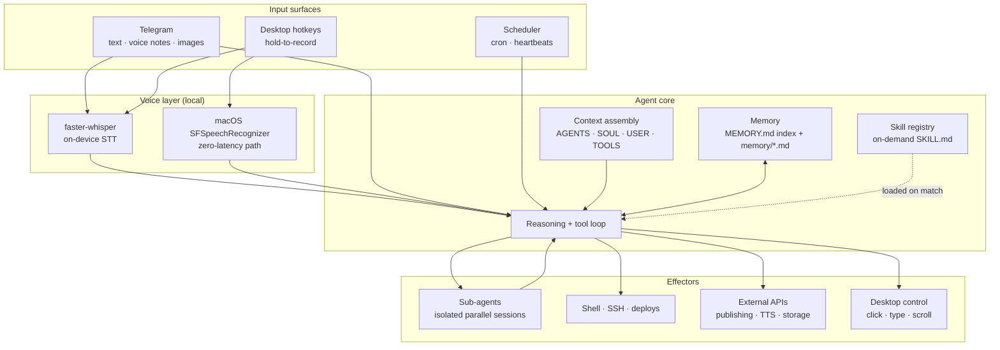

# Aihylu

An always-on, voice-first AI agent that lives on a Mac mini, runs for weeks at a
time, remembers across restarts, and does real work unattended — publishing
video, deploying sites, driving the desktop by voice.

This repository is a **showcase**. It contains the architecture, the design
decisions, and representative excerpts of the code. The live agent's memory,
inbox, credentials, and personal project data are deliberately not here.

---

## What it actually is

Most "AI assistants" are a chat window: you open it, you ask, it answers, the
context dies. Aihylu is the opposite shape.

- **Always on.** A long-lived process, not a session. It is reachable from a
  phone at 2 a.m. and it is still the same agent in the morning.
- **Voice-first.** Hold a hotkey on the desktop and talk; send a voice note from
  the phone and it transcribes locally and acts. Typing is the fallback, not the
  default.
- **Persistent.** Memory is a curated file tree, not a vector blob. The agent
  reads it at wake-up, writes to it during work, and prunes it on a schedule.
- **Autonomous on a clock.** Scheduled jobs fire into isolated sessions and
  report back. Pipelines run overnight and the result is waiting in the morning.
- **Opinionated about its own limits.** Outward-facing actions — publishing,
  sending, deploying — stop and ask. Internal ones don't.

Built on [OpenClaw](https://github.com/openclaw/openclaw) as the agent runtime,
with Claude as the model layer. The engineering on display here is the layer
above: context architecture, memory discipline, skill design, scheduling, the
voice stack, and the automation pipelines.

---

## Architecture



### 1. The context layers

The agent's identity and operating rules are **files, not a system prompt
constant**. Each layer answers a different question and changes at a different
rate:

| Layer | Question it answers | Churn |
| --- | --- | --- |
| `AGENTS.md` | How do I operate? Red lines, group-chat etiquette, when to speak, when to ask. | rare |
| `SOUL.md` | Who am I? Tone, opinions, what "helpful" means here. | rare |
| `USER.md` | Who am I working for? Name, timezone, projects. | rare |
| `TOOLS.md` | What is wired up *on this machine*? Hosts, device names, voice IDs. | occasional |
| `MEMORY.md` | What do I know? A one-line index into `memory/`. | daily |
| `memory/*.md` | The facts themselves — one per file, front-matter typed. | continuous |

Splitting these is the whole trick. Skills are shareable because they contain no
environment; environment lives in `TOOLS.md`. Persona survives a memory rewrite
because it is not stored with the memories. And the index/body split means the
agent carries ~70 one-line hooks in context and pays for a full memory only when
it reaches for one.

### 2. Memory

Three tiers, on purpose:

- **Daily notes** — `memory/YYYY-MM-DD.md`, raw and append-only. What happened.
- **Curated memory** — `memory/<slug>.md`, one fact per file, typed as
  `user` / `feedback` / `project` / `reference`, cross-linked with `[[wiki-links]]`.
- **Index** — `MEMORY.md`, one line per memory, loaded every session.

Retrieval is semantic search across the memory tree *and* indexed session
transcripts, so "what did we decide about X in August" is answerable without the
transcript being in context.

The rule that makes it work is social, not technical: **a mental note is not a
note.** Anything worth keeping is written to a file in the turn it was learned —
especially corrections. A `feedback` memory records what the human pushed back
on and *why*, which is what stops the same mistake recurring next week.

### 3. Skills

A skill is a markdown file with YAML front-matter. Only the `description` stays
resident; the body is loaded when a task matches it. Dozens of capabilities,
near-zero standing context cost — progressive disclosure applied to tooling.

Skills in the live agent cover video production pipelines, publishing with
readiness gates, site deployment, mail, and social posting.
Two anonymised examples are in [`examples/skills/`](examples/skills/).

### 4. Task intake and execution

Work arrives three ways:

- **Conversationally** — text or voice, from anywhere.
- **On a schedule** — cron jobs targeting either the main session (as a system
  event, when the agent should notice something) or an isolated session (as a
  full agent turn, when the job should run and report without polluting the main
  context).
- **By heartbeat** — a low-frequency poll where the agent decides for itself
  whether anything is worth raising. Most heartbeats are silence.

Long or parallel work is delegated to **sub-agents**: isolated child sessions
with their own context, spawned with an explicit objective and write-scope, then
awaited. The parent keeps a clean context and gets a conclusion instead of a
transcript.

### 5. Guardrails that survived contact with reality

These are the rules that exist because something went wrong once:

- **Readiness gates before irreversible steps.** The video publisher refuses to
  go live until every asset reports `processingStatus: succeeded` — a 100 %
  upload is not a finished upload, and publishing early serves viewers a 360p
  render.
- **Publication always asks.** Preview first, then an explicit yes. The agent
  never ships to a public channel on its own initiative.
- **Inspect before you overwrite.** Schedulers, configs and rc files get read and
  merged, never clobbered by a one-liner.
- **`trash`, not `rm`.**
- **Report failures as failures.** A job that didn't run is reported as not run,
  with the error — never smoothed over.

---

## The voice stack

Five chords, each with a different cost/latency profile. The cheap ones never
touch a model at all:

| Chord | Mode | Path |
| --- | --- | --- |
| `Ctrl+Shift+Q` | quick | native macOS STT → paste. No model, no network. |
| `Ctrl+Shift+D` | dictate | Whisper → paste into the focused field. |
| `Ctrl+Shift+V` | structure | Whisper → model rewrites into structured text → clipboard. |
| `Ctrl+Shift+S` | screen Q&A | screenshot + Whisper → model answers about what's on screen. |
| `Ctrl+Shift+A` | agent | screenshot + Whisper → tool-using agent drives the desktop. |

Two details worth calling out:

**Hotkeys are intercepted, not observed.** A passive listener lets the chord
through to the focused app, so browsers answer `Ctrl+Shift+S` with an error beep
on every single recording — including once per key-repeat. An active
`CGEventTap` at the head of the session stream rewrites the event to
`kCGEventNull` and it never happens.
See [`examples/voice/hotkey_tap.py`](examples/voice/hotkey_tap.py).

**Transcription is local.** `faster-whisper`, int8 on CPU. Audio never leaves the
machine; for `quick` and `dictate`, nothing leaves the machine at all. A signal
gate (duration + RMS) drops accidental taps and room tone before any inference
runs. See [`examples/voice/pipeline_worker.py`](examples/voice/pipeline_worker.py).

The agent mode is a vision-grounded tool loop: the model gets a screenshot,
issues a tool call, and can call `take_screenshot` again to check its own work
before continuing — bounded by a hard step ceiling and an explicit `finish` tool.
See [`examples/orchestration/agent_loop.py`](examples/orchestration/agent_loop.py).

---

## Prompt and context engineering

The parts that took the most iteration, and matter the most:

- **Index/body split for memory.** Carrying summaries, paying for details.
- **Progressive disclosure for skills.** Descriptions resident, bodies on demand.
- **Model routing per task.** A reasoning model for planning and conversation; a
  fast cheap model for voice calls and mechanical rewrites; a vision model for
  bulk frame-quality gating, where the alternative is a human watching hours of
  footage. Picking one model for everything is how you get a slow, expensive
  agent that is also worse.
- **Negative instructions carry their reason.** "Don't claim X" without "because
  X was measured at 81.9 %, not 98 %" gets re-derived and violated later.
- **Typed memories.** `feedback` memories are written as fact → **why** → **how
  to apply**, which is what makes them actionable at recall time instead of
  nostalgic.
- **Isolation as a context tool.** Noisy work goes to a sub-agent so the main
  thread keeps its signal-to-noise.

---

## Stack

**Core** — Python 3.11, Node.js 20, Claude (Opus / Sonnet / Haiku, tool use +
vision), OpenClaw agent runtime, launchd + cron.

**Voice** — faster-whisper (local STT), macOS `SFSpeechRecognizer`, pyobjc
(Quartz / AppKit) for event taps and desktop control, pywebview UI, sounddevice,
ElevenLabs for TTS.

**Automation** — ffmpeg, YouTube Data API v3 with OAuth refresh handling,
Telegram Bot API, Stripe, LinkedIn API, Replicate, S3-compatible object storage,
rsync + systemd deploys over SSH.

**Practices** — environment-only secrets, idempotent uploaders with on-disk logs,
readiness gates before irreversible actions, quota-aware scheduling, dry-run
before destructive sync.

---

## Setup

The live agent is bound to one machine and one owner, so this repo is a reference
rather than a one-command install. To run the pieces here:

```bash
git clone <this repo>
cd aihylu

cp .env.example .env
#  then fill in .env — it ships with names only, never values

python3 -m venv .venv && source .venv/bin/activate
pip install anthropic faster-whisper sounddevice soundfile numpy pyobjc pywebview
```

Every credential is read from the environment. There is no code path that reads a
key from a file in this repository, and `.gitignore` blocks `.env`, `token*.json`,
`credentials/`, `client_secret*`, `memory/`, `media/` and `history.json`.

On macOS the voice client needs **Accessibility** permission (System Settings →
Privacy & Security → Accessibility) for the event tap, and **Microphone** and
**Screen Recording** for the capture modes. Without Accessibility it degrades to
a passive key listener instead of failing.

---

## Repository contents

```
README.md                              architecture and design notes
.env.example                           every variable the agent reads, names only
.gitignore                             secrets, memory and media blocked
examples/
  skills/deploy-site/SKILL.md          generic skill manifest: deploy with guardrails
  skills/daily-digest/SKILL.md         generic skill manifest: scheduled unattended report
  voice/hotkey_tap.py                  OS-level hotkey interception (CGEventTap)
  voice/pipeline_worker.py             audio gate -> local transcription -> mode routing
  orchestration/agent_loop.py          vision-grounded tool-use loop with step budget
```

Code under `examples/` is excerpted from the running agent and trimmed for
publication: real paths, hosts and identifiers are replaced with placeholders,
and host bindings are left as stubs.
